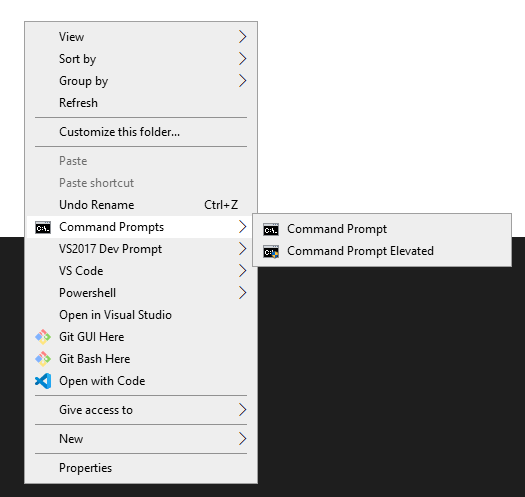
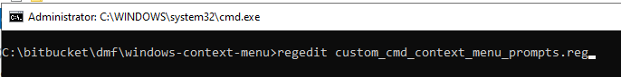

# Windows-Context-Menu

Sometimes it would be really nice to be able to open a visual studio developer command prompt from the shell's context menu, so that it would open in the current directory and with elevated permissions.  Adding the context menu entry is actually pretty easy using the .inf files located at https://github.com/kzu/CommandPromptHere. 

However, if you also want to be able to open the prompt with elevated permissions (admin mode), it's slightly trickier, but not too much.  

Based on the blog post from here, I created a .reg scripts that will do the following:

- **custom_cmd_context_menu_prompts.reg** - Add a Command Prompts context menu with two entries: basic command prompt and elevated command prompt
- **custom_powershell_context_menu_prompts.reg** - Add a Powershell context menu with two entries: basic powershell and elevated powershell
- **custom_vs2017_*_context_menu_prompts.reg** - Add a VS2017 Dev Prompt context menu with two entries: basic VS 2017 developer prompt and elevated VS 2017 developer prompt
- **custom_vs2019_*_context_menu_prompts.reg** - Add a VS2019 Dev Prompt context menu with two entries: basic VS 2019 developer prompt and elevated VS 2019 developer prompt
- **custom_vscode_context_menu_prompts.reg** - Add a VS Code context menu with two entries: basic VS Code and elevated VS Code

These will be available in both the shell and background context menus (when you right-click on a folder node or right-click in the background in a folder).  I added back the command shell prompt because the default shell changed to PowerShell in the Windows 10 Creators Update.

---

# To Run

Open a powershell prompt as administrator and run the install.ps1 script.  This script will interactively install the four context menus, if possible.

Alternately, the *.reg scripts can be used by themselves with regedit (or reg import).
To run the script, open a command prompt as administrator and pass the script to the regedit command.

---

# Warnings

Note that the install script supports both Visual Studio 2017 and 2019 Enterprise, Professional and Community editions using the default installation directory.  Visual Studio 2019 installations take precedence over 2017 installations if both are installed, so that developer command prompts are only installed for one version.

Note that the script is specific to Visual Studio 2017 and the default installation directory.  It does support the Enterprise, Professional and Community editions.  It will need to be adjusted if you don't have that.

---

# Todo
Add scripts to clean up the registry if you want to remove these context menus
